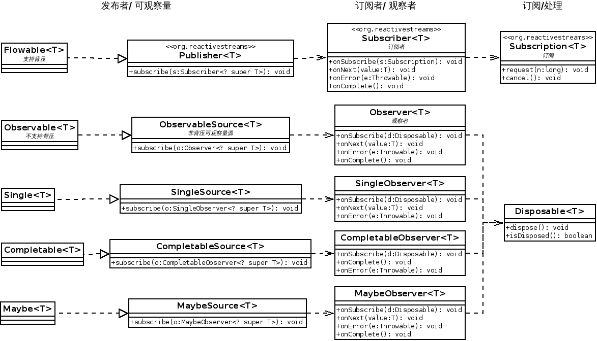

响应式编程实践
============

[TOC] 

## 1 响应式介绍

### 1.1 什么是响应式编程(Reactive Programming)

- 响应式编程 是一种 基于对变化的响应的一种编程范式;
- RxJava响应式编程 = 观察者模式(Observer Pattern) + 迭代器模式(Iterator Pattern) + 函数式编程


### 1.2 响应式宣言（[Reactive Manifesto](https://github.com/reactivemanifesto/reactivemanifesto)）：

来自不同领域的组织正在不约而同地发现一些看起来如出一辙的软件构建模式。它们的系统更加稳健，更加有可回复性，更加灵活，并且以更好的定位来满足现代的需求。

响应式宣言针对一个系统而言，并不等同于 响应式编程规范，响应式系统应该满足如下特点：

- 反应灵敏的[Responsive]：只要有可能，系统就会及时响应。 
- 有回复性的[Resilient]：系统在面临故障时也能保持及时响应。
- 可伸缩的[Elastic]：系统在变化的工作负载下保持及时响应。
- 消息驱动的[Message Driven]：响应式系统依赖异步消息传递来建立组件之间的界限，这一界限确保了松耦合，隔离，位置透明性等特性的实现，还提供了以消息的形式把故障委派出去的手段。


## 1.3 响应式编程规范

### 1.3.1 响应式流规范（[Reactive Streams](http://www.reactive-streams.org/)）

- Reactive Streams 规范提供一个非堵塞的异步流处理的抗压(breakpressure)标准；Reactive Streams的目标是增加抽象层，而不是进行底层的流处理，规范将这些问题留给了库实现来解决。

- 对于JVM，目前已经有多个库实现该标准，RxJava2, akka-streams,Reactor[[5]](https://github.com/reactor/reactor) 等；
- 统一标准的好处就是 各个实现产生的数据可以方便的转换和消费；

> 示例

```java 
    Path filePath = Paths.get("build.gradle");
    // RxJava2 to Reactor
    Flowable<String> flowable = Flowable
            .fromCallable(() -> Files.readAllLines(filePath))
            .flatMap(x -> Flowable.fromIterable(x));
    Flux.from(flowable).count().subscribe(System.out::println);

    // Reactor to RxJava2
    try
    {
        Flux<String> flux = Flux.fromIterable(Files.readAllLines(filePath));
        Flowable.fromPublisher(flux).count()
                .subscribe(System.out::println);
    }
    catch (IOException e)
    {
        e.printStackTrace();
    }
```
- Reactive Streams JVM接口由以下四个interface 组成：
    - Publisher ： 

    - Subscriber ：

    - Subscription ：

    - Processor ：

- Reactive Streams 规范主要目标[[2]](https://www.infoq.com/news/2015/09/reactive-streams-introduction)：
    
    - 通过异步边界(Asynchronous Boundary)[[3]](https://github.com/reactive-streams/reactive-streams-jvm/issues/46)来解耦系统组件。 解偶的先决条件，分离事件/数据流的发送方和接收方的资源使用;
    - 为背压（ back pressure ) 处理定义一种模型。流处理的理想范式是将数据从发布者推送到订阅者，这样发布者就可以快速发布数据，同时通过压力处理来确保速度更快的发布者不会对速度较慢的订阅者造成过载。背压处理通过使用流控制来确保操作的稳定性并能实现优雅降级，从而提供弹性能力。

- 该规范将包含在 JDK 9 的java.util.concurrent.Flow 类中，包含四个接口类[[7]](http://gee.cs.oswego.edu/dl/jsr166/dist/docs/java/util/concurrent/Flow.html)。 

- 适用范围： 适合于流处理的系统有ETL（Extract、Transform、Load）与复杂事件处理（CEP）系统，此外还有报表与分析系统[[4]](https://medium.com/@kvnwbbr/a-journey-into-reactive-streams-5ee2a9cd7e29)。

### 1.3.2 响应式扩展（Reactive Extensions, ReactiveX,Rx）
- ReactiveX是Reactive Extensions的缩写，一般简写为Rx，最初是LINQ的一个扩展，由微软的架构师Erik Meijer领导的团队开发，在2012年11月开源[[1]](http://download.microsoft.com/download/4/E/4/4E4999BA-BC07-4D85-8BB1-4516EC083A42/Rx%20Design%20Guidelines.pdf)；

- Rx是一个编程模型，目标是提供一致的编程接口，帮助开发者更方便的处理异步数据流，Rx库支持.NET、JavaScript和C++，Rx近几年越来越流行了，现在已经支持几乎全部的流行编程语言了，Rx的大部分语言库由ReactiveX这个组织负责维护，比较流行的有RxJava/RxJS/Rx.NET，社区网站是 reactivex.io。

- Rx = Observables + LINQ + Schedulers。Rx 让开发者可以利用可观察序列和LINQ风格查询操作符来编写异步和基于事件的程序;

- RxJava 是 在Java虚拟机上实现的Reactive Extensions（响应式扩展)库;  


## RxJava 基础

### RxJava现状
- RxJava 项目地址 <https://github.com/ReactiveX/RxJava>
- RxJava 1.x 先于 Reactive Streams 规范出现,部分接口支持Reactive Streams 规范；
- RxJava 2.0 于 2016.10.29 正式发布[[8]](https://github.com/ReactiveX/RxJava/releases/tag/v2.0.0)，已经按照Reactive-Streams specification规范完全的重写, 基于Java8+;
- RxJava 2.0已经独立于RxJava 1.x而存在，即 RxJava2(io.reactivex.*)  使用与RxJava1（rx.*） 不同的包名。
- RxJava 在Android 开发上应用较多；

### RxJava 能处理的问题

|| 单个数据 	|  多个数据 | 
|:--|:--|:--|
| 同步	|T getData()        |	Iterable\<T\> getData()   |
| 异步	|Future\<T\> getData()|	Observable\<T\> getData() |


https://www.lightbend.com/blog/7-ways-washing-dishes-and-message-driven-reactive-systems


### RxJava 1 vs RxJava 2


- RxJava 2x 不再支持 null 值，如果传入一个null会抛出 NullPointerException

```java
    Observable.just(null);
    Single.just(null);
    Flowable.just(null);
    Maybe.just(null);
    Observable.fromCallable(() -> null)
            .subscribe(System.out::println, Throwable::printStackTrace);
    Observable.just(1).map(v -> null)
            .subscribe(System.out::println, Throwable::printStackTrace);

```
 - RxJava2 所有的函数接口(Function/Action/Consumer)均设计为可抛出Exception，解决编译异常需要转换问题。

 - RxJava1 中Observable不能很好支持背压，在RxJava2 中将Oberservable实现成不支持背压，而新增Flowable 来支持背压。
 - 详细参考请参考<<What%27s-different-in-2.0>>[[6]](https://github.com/ReactiveX/RxJava/wiki/What%27s-different-in-2.0)

### RxJava2中的响应式类

#### RxJava2 主要类关系图
如下图所示，为RxJava2中的主要类关系图，可清晰知道各响应式类的联系和区别。后面无特别说明均以Flowable说明。



#### Flowable & Observable

- **Observable**: 不支持背压；

- **Flowable** : Observable新的实现，支持背压，同时实现Reactive Streams 的 Publisher 接口。

- 什么时候用 Observable:
    - 一般处理最大不超过1000条数据，并且几乎不会出现内存溢出； 
    - 如果式GUI 鼠标事件，频率不超过1000 Hz,基本上不会背压（可以结合 sampling/debouncing 操作）；
    - 如果处理的式同步流而你的Java平台又不支持Java Stream（如果有异常处理，Observable 比Stream也更适合）;

- 什么时候用 Flowable: 
    - 处理以某种方式产生超过10K的元素；
    - 文件读取与分析，例如 读取指定行数的请求；
    - 通过JDBC 读取数据库记录， 也是一个阻塞的和基于拉取模式，并且由ResultSet.next() 控制；
    - 网络IO流;
    - 有很多的阻塞和/或 基于拉取的数据源，但是又想得到一个响应式非阻塞接口的。

#### 2.3.2  Single & Completable & Maybe

- **Single**: 可以发射一个单独onSuccess 或 onError消息。它现在按照Reactive-Streams规范被重新设计,并遵循协议 onSubscribe (onSuccess | onError)? .SingleObserver改成了如下的接口;
```
interface SingleObserver<T> {
    void onSubscribe(Disposable d);
    void onSuccess(T value);
    void onError(Throwable error);
}
```

- **Completable**: 可以发送一个单独的成功或异常的信号，按照Reactive-Streams规范被重新设计,并遵循协议onSubscribe (onComplete | onError)?
```
    Completable.create(new CompletableOnSubscribe()
    {
        @Override
        public void subscribe(CompletableEmitter e) throws Exception
        {
            Path filePath = Paths.get("build.gradle");
            Files.readAllLines(filePath);
            e.onComplete();
        }
    }).subscribe(() -> System.out.println("OK!"),
            Throwable::printStackTrace);
```
- **Maybe**:从概念上来说，它是Single 和 Completable 的结合体。它可以发射0个或1个通知或错误的信号, 遵循协议 onSubscribe (onSuccess | onError | onComplete)?。
```
    Maybe.just(1)
            .map(v -> v + 1)
            .filter(v -> v == 1)
            .defaultIfEmpty(2)
            .test()
            .assertResult(21);
//        java.lang.AssertionError: Values at position 0 differ; Expected: 21 (class: Integer), Actual: 2 (class: Integer) (latch = 0, values = 1, errors = 0, completions = 1)
//
//        at io.reactivex.observers.BaseTestConsumer.fail(BaseTestConsumer.java:133)
//        ....
```

## RxJava2 的主要操作

我们已经知道 RxJava主要特性为为一个扩展的观察者模式、流式操作和异步编程，支持ReactiveX 规范给出的一些操作， 同时RxJava2 符合响应式流规范，接下来以Flowable为例，按照功能分类讲解RxJava2中的重要操作[[9]](http://reactivex.io/documentation/operators.html);

### 创建一个Flowable

- fromArray & fromIterable & just,直接从数组或迭代器中产生；

```java
    List<String> list = Arrays.asList(
            "blue", "red", "green", "yellow", "orange", "cyan", "purple"
    );
    Flowable.fromIterable(list).skip(2).subscribe(System.out::println);
    Flowable.fromArray(list.toArray()).subscribe(System.out::println);
    Flowable.just("blue").subscribe(System.out::println);
```

- fromFuture & fromCallable：
>fromFuture, 事件从非主线程中产生；
fromCallable, 事件从主线程中产生， 在需要消费时生产；
```java
    ExecutorService executor = Executors.newFixedThreadPool(2);
    System.out.println("MAIN: " + Thread.currentThread().getId());
    Callable<String> callable = () -> {
        System.out.println("callable [" + Thread.currentThread().getId() + "]: ");
        Path filePath = Paths.get("build.gradle");
        return Files.readAllLines(filePath).stream().flatMap(s -> Arrays.stream(s.split
                (""))).count() + "";
    };

    Future<String> future = executor.submit(callable);

    Consumer<String> onNext = v -> System.out
            .println("consumer[" + Thread.currentThread().getId() + "]:" + v);

    Flowable.fromCallable(callable).subscribe(onNext);
    Flowable.fromFuture(future).subscribe(onNext);
    System.out.println("END");
```
- fromPublisher ，从标准(Reactive Streams)的发布者中产生；

- 自定义创建(generate & create)
> 下面以斐波那契数列产生为例说明 generate & create的使用， generate为RxJava2新增的创建方式。 
```java
    class Fib
    {
        long a;
        long b;

        public Fib(long a, long b)
        {
            this.a = a;
            this.b = b;
        }

        public long fib()
        {
            return a + b;
        }
    }

    //斐波那契数列
    Flowable.create(new FlowableOnSubscribe<Fib>()
    {
        @Override
        public void subscribe(FlowableEmitter<Fib> e) throws Exception
        {
            Fib start = new Fib(1L, 1L);

            while (!e.isCancelled()) {
                e.onNext(start);
                start = new Fib(start.b, start.fib());
            }
            e.onComplete();
        }
    }, BackpressureStrategy.BUFFER).map(x -> x.fib()).take(10).subscribe(System.out::println);

    Flowable.generate(() -> new Fib(1L, 1L), (x, y) -> {
        Fib fib = new Fib(x.b, x.fib());
        y.onNext(fib);
        return fib;
    }).ofType(Fib.class).map(x -> x.fib()).take(10).subscribe(System.out::println);
```


- amb & concat & merge, 由多个Flowable产生结合;

   -  **amb**: 给定两个或多个Flowable，只发射最先发射数据的Flowable，如下面示例中的f1被发射； 

   - **concat**: 给定多个Flowable， 按照Flowable数组顺序,依次发射数据，不会交错，下面示例中f1,f2中数据依次发射;
   - **merge**: 给定多个Flowable， 按照Flowable数组中数据发射的顺序组合成新的Flowable，各Flowable数据可能会交错；
   - **switchOnNext**：给定能发射多个Flowable的Flowable,顺序发射各子Flowable,最新发射的子Flowable覆盖当前子Flowable中还未发射的元素。
    

```java
    Flowable<String> f1 = Flowable.intervalRange(1, 10, 1, 1, TimeUnit.SECONDS).map(index -> "f1-" + index);
    Flowable<String> f2 = Flowable.intervalRange(1, 3, 2, 2, TimeUnit.SECONDS).map(index -> "f2-" + index);

    Flowable.ambArray(f1, f2).map(x -> "amb: " + x).subscribe(System.out::println);
    System.out.println("----------concat-----------");
    Flowable.concat(f1, f2).map(x -> "concat: " + x).subscribe(System.out::println);

    System.out.println("----------merge-----------");
    Flowable.merge(f1, f2).map(x -> "merge: " + x).subscribe(System.out::println);

    Flowable<String>[] flowables = new Flowable[]{f1, f2};
    Flowable.switchOnNext(Flowable.intervalRange(0, 2, 0, 3, TimeUnit.SECONDS).map(i -> flowables[i.intValue()]))
            .map(x -> "switchOnNext-" + x).subscribe(System.out::println);
    Flowable.intervalRange(0, 2, 0, 3, TimeUnit.SECONDS).map(i -> flowables[i.intValue()])
            .switchMap((io.reactivex.functions.Function) Functions.identity())
            .map(x -> "switchMap-" + x).subscribe(System.out::println);
```
- zip & combineLatest, 多Flowable中元素结合变换
    - **zip** ：每个Flowable中的元素都按顺序结合变换，直到元素最少Flowable的已经发射完毕；
    

    - **combineLatest**: 每个Flowable中的发射的元素都与其他Flowable最近发射的元素结合变换，知道所有的Flowable的元素发射完毕；
    


### 转换、过滤与聚合操作
在Java8中Stream也有包含这些功能的操作，由于多了时间这个维度，在 RxJava 中操作相对更加丰富。
这里主要介绍一些重点操作。

- buffer & groupBy & window
>buffer 和 window 都可以按时间或者元素数量窗口，buffer是直接转换成元素集，window是将元素集转换成另一个Flowable，
>groupBy,按照key 来分组，需要元素发射完成才能消费，如果只是对数据处理使用Java8 groupBy更方便；

```java
    Flowable<String> f1 = Flowable.intervalRange(1, 10, 1, 1, TimeUnit.SECONDS).delay((t) ->
            Flowable.timer(t % 3 + new Random().nextLong() % 3, TimeUnit.SECONDS))
            .map(index -> index % 3 + "-f1-" + index);
    f1.buffer(5, TimeUnit.SECONDS).map(x -> "buffer-" + x).subscribe(System.out::println);

    f1.window(5, TimeUnit.SECONDS).map(x -> x.toList())
            .subscribe(x -> x.subscribe(System.out::println));

    Disposable b = f1.groupBy((x) -> x.split("-", 2)[0])
            .subscribe(x -> x.toList().subscribe(System.out::println));
    Map<String, List<String>> map = f1.toList().blockingGet().stream()
                .collect(Collectors.groupingBy((x) -> x.split
                        ("-", 2)[0]));
    System.out.println(map);

    while (!b.isDisposed()) {
    }

```
- debounce & throttleFirst & sample 按照时间区间采集数据
> debounce 防抖动，两元素发射间隔，在设定的超时时间内将不被发射， 在前端APP应用较多。


> throttle 限流操作，对于 throttleFirst是 取发射后元素，经过间隔时间后的第一个元素进行发射。


> sample 数据采样, 对于源数据，发射间隔时间内的最后出现的元素。


- take & skip & first & emlmentAt,精确获取数据(集)
> take, 类似java8 limit 操作，但是这里支持更多的操作(take/takeLast/takeUntil/takeWhen)，同时支持在时间区间上获取数据集；
> skip, 类似java8 skip 操作,但是这里的可以扩展到时间区间上
> first/firstElement/last/lastElement, 由 Flowable -> Single/Maybe.

```java
        Flowable<String> f1 = Flowable
                .fromArray("blue", "red", "green", "yellow11", "orange", "cyan", "purple"
                );

        f1.elementAt(4, "hello").subscribe(System.out::println);
        //out: orange
        f1.takeUntil(x -> x.length() > 5).map(x -> "takeUntil-" + x).toList()
                .subscribe(System.out::println);
        //out: [takeUntil-blue, takeUntil-red, takeUntil-green, takeUntil-yellow11]
        f1.takeWhile(x -> x.length() <= 5).map(x -> "takeWhile-" + x).toList()
                .subscribe(System.out::println);
        //out: [takeWhile-blue, takeWhile-red, takeWhile-green]

        f1.skipWhile(x -> x.length() <= 5).map(x -> "skipWhile-" + x).toList()
                .subscribe(System.out::println);
        //[skipWhile-yellow11, skipWhile-orange, skipWhile-cyan, skipWhile-purple]

        Disposable d = f1.delay(v -> Flowable.timer(v.length(), TimeUnit.SECONDS))
                .skipUntil(Flowable.timer(5, TimeUnit.SECONDS)).map(x -> "skipUntil-" + x)
                .subscribe(System.out::println);
//        skipUntil-green
//        skipUntil-orange
//        skipUntil-purple
//        skipUntil-yellow11
        while (!d.isDisposed()) {
        }

```

### 3.3 异步与并发（Asynchronized & Concurrency）


### 3.4 异常处理 (Error Handleing)

### 3.5 背压(back pressure)

### 3.6 RxJava 测试


## 再谈函数式编程

### Functor 和 Monads

http://ifeve.com/java%E4%B8%AD%E7%9A%84functor%E4%B8%8Emonad/


## Reference

1. 响应式宣言.https://github.com/reactivemanifesto/reactivemanifesto/blob/master/README.zh-cn.md

2. RxJava 2.0 Released with Support for Reactive Streams Specification. https://www.infoq.com/news/2016/11/rxjava-2-with-reactive-streams


